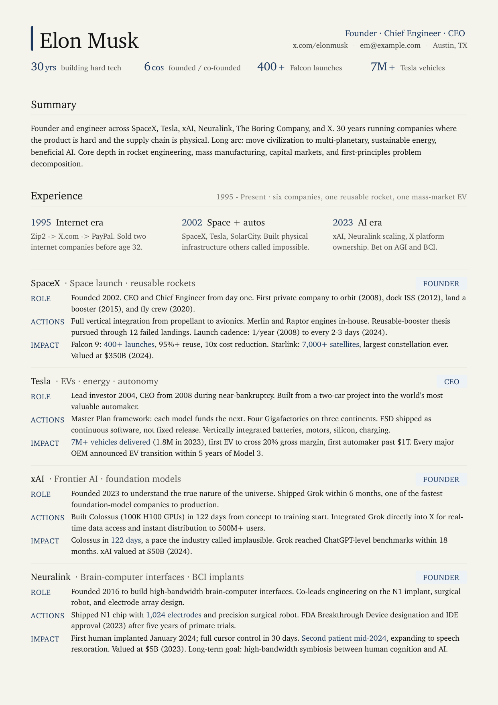
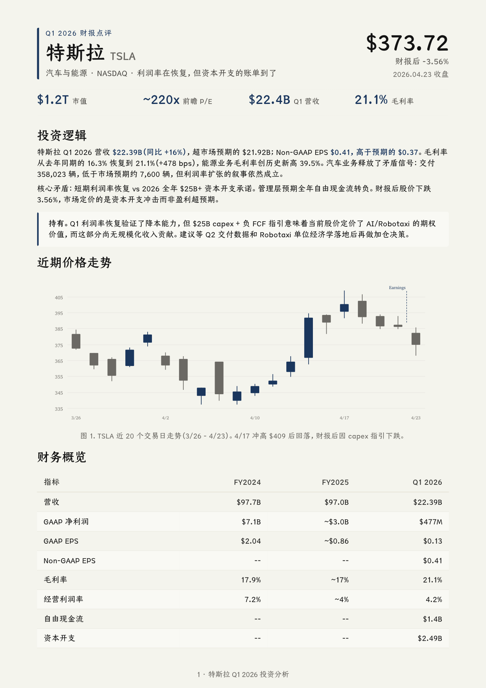
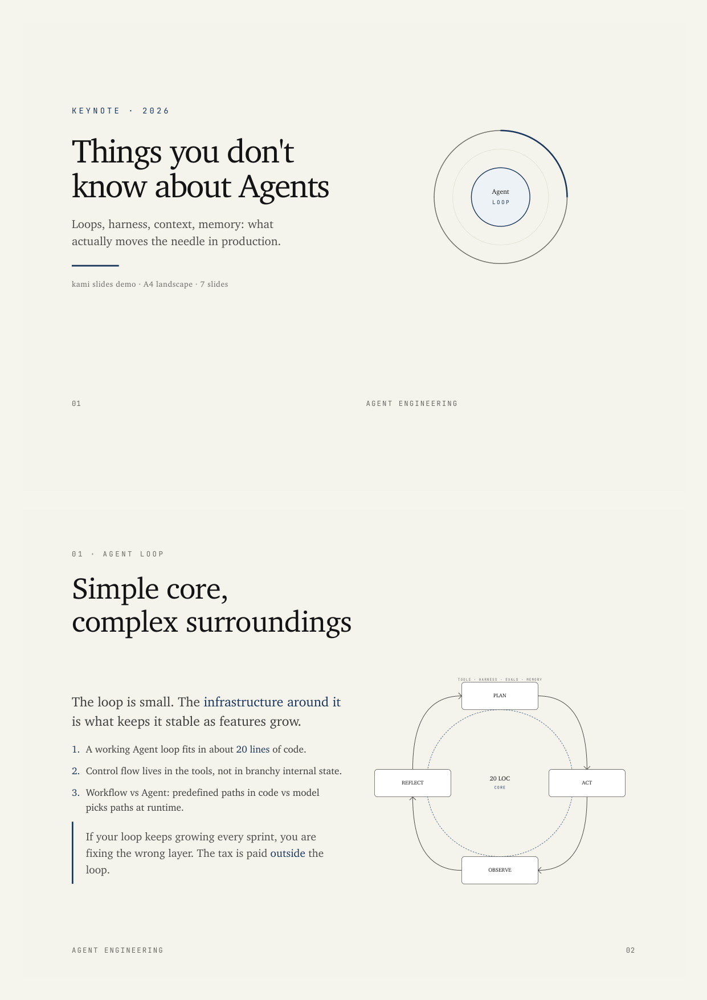

# satgat

> 자연어를 한지(韓紙) 감성의 한국형 문서로 옮겨 적는 AI 문서 생성기.

[](LICENSE)
[](https://nextjs.org)
[](https://react.dev)

`satgat`은 한국 이름으로 **삿갓**입니다. 사용자가 하고 싶은 이야기를 자연어로 적으면, AI가 문서 구조를 잡고 한지 위에 먹글씨를 얹은 듯한 시각 언어로 완성 문서를 렌더링합니다.

워드 기본 양식, 흰 배경 SaaS 문서, 해외 템플릿 번역체 대신 한국어 문서가 자연스럽게 읽히는 종이, 여백, 글꼴, 인장, 색을 기준으로 설계했습니다.


## 예시 갤러리

아래 예시는 satgat이 목표로 하는 출력 범위를 보여 주는 번들 샘플입니다. 긴 문서, 리포트, 덱처럼 서로 다른 밀도와 판형을 한 디자인 시스템 안에서 다룹니다.

| 이력서형 장문 문서 | 리포트형 문서 | 발표 덱 |
| --- | --- | --- |
|  |  |  |
| [HTML](public/satgat/assets/demos/demo-musk-resume.html) · [PDF](public/satgat/assets/demos/demo-musk-resume.pdf) | [HTML](public/satgat/assets/demos/demo-tesla.html) · [PDF](public/satgat/assets/demos/demo-tesla.pdf) | [HTML](public/satgat/assets/demos/demo-agent-slides.html) · [PDF](public/satgat/assets/demos/demo-agent-slides.pdf) |

## 동작 흐름

1. 만들 문서의 종류를 고릅니다.
2. 자연어로 목적, 대상, 핵심 내용, 분위기를 적습니다.
3. AI가 구조화된 문서 데이터를 만들고 satgat 템플릿이 브라우저에서 미리보기 가능한 문서로 렌더링합니다.
4. 결과를 검토한 뒤 인쇄하거나 PDF로 저장합니다.

## 만들 수 있는 문서

- 이력서
- 자기소개서
- 명함
- 청첩장
- 연하장
- 회사 제안서
- 뉴스레터
- 포트폴리오
- 회사 소개서
- 제품 소개서
- 브랜드 원페이지
- 브랜드 스토리북
- 투자 IR 덱

종이를 고르고 담을 이야기를 적으면, AI가 템플릿 슬롯을 채운 뒤 브라우저에서 미리보기와 인쇄/PDF 저장이 가능한 문서로 보여 줍니다.

## 디자인 원칙

- 순백 배경 대신 한지 톤 캔버스 사용
- 먹색 본문과 따뜻한 황갈 계열 회색 사용
- 무궁화, 단청, 취색, 금박을 절제된 강조색으로 사용
- Nanum Myeongjo, Gowun Batang, Gowun Dodum 중심의 한국어 글꼴 위계
- A4, A5, 명함, 16:9 덱까지 인쇄를 고려한 레이아웃
- 합성 볼드와 유료 폰트 의존을 피하고 OFL 무료 폰트 중심으로 구성

## 기술 스택

- Next.js 16 App Router
- React 19
- TypeScript
- AI SDK + `@ai-sdk/google`
- Zod 런타임 검증
- CSS 디자인 토큰 + Tailwind 4 도구 체인

## 시작하기

```bash
git clone https://github.com/unclejobs-ai/satgat.git
cd satgat
npm install
```

`.env.local`을 만들고 Gemini API 키를 넣습니다.

```bash
GOOGLE_GENERATIVE_AI_API_KEY=your_key_here
```

개발 서버를 실행합니다.

```bash
npm run dev
```

브라우저에서 `http://localhost:3000`을 엽니다.

## 스크립트

```bash
npm run dev      # 로컬 개발 서버
npm run build    # 프로덕션 빌드
npm run start    # 프로덕션 서버 실행
npm run lint     # ESLint 검사
```

## 프로젝트 구조

```text
app/                    Next.js 라우트와 API 핸들러
public/satgat/          정적 specimen 페이지와 디자인 시스템 자산
src/components/         문서/템플릿 React 컴포넌트
src/lib/design-system/  한지, 먹색, 단청, 취색, 금박 토큰
src/lib/templates/      문서 템플릿 정의와 registry
src/lib/engine/         렌더러와 검증 계층
src/lib/generation/     AI 문서 생성 로직
references/             한국어 문서 작성과 디자인 브리프
docs/                   아키텍처 문서
```

## 공개 저장소

이 프로젝트의 단독 public origin은 아래 주소를 기준으로 합니다.

```text
https://github.com/unclejobs-ai/satgat
```

## 라이선스

MIT © 2026 EungjePark
