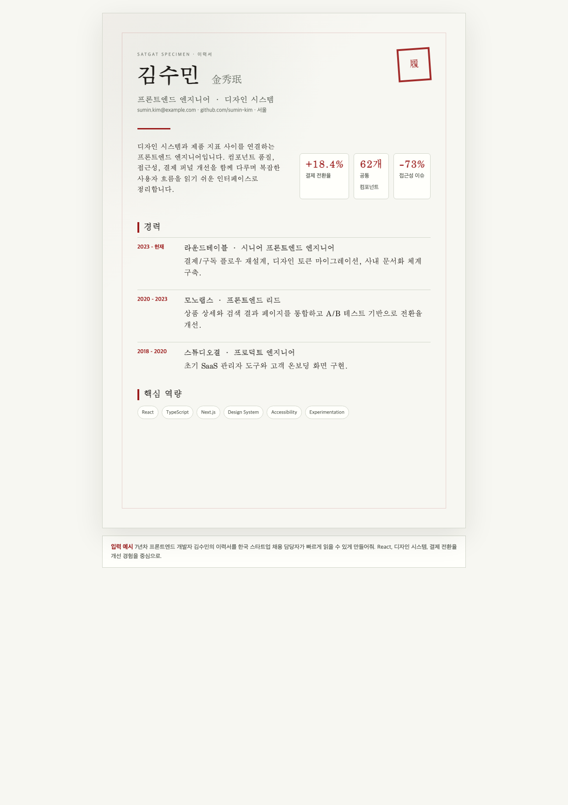
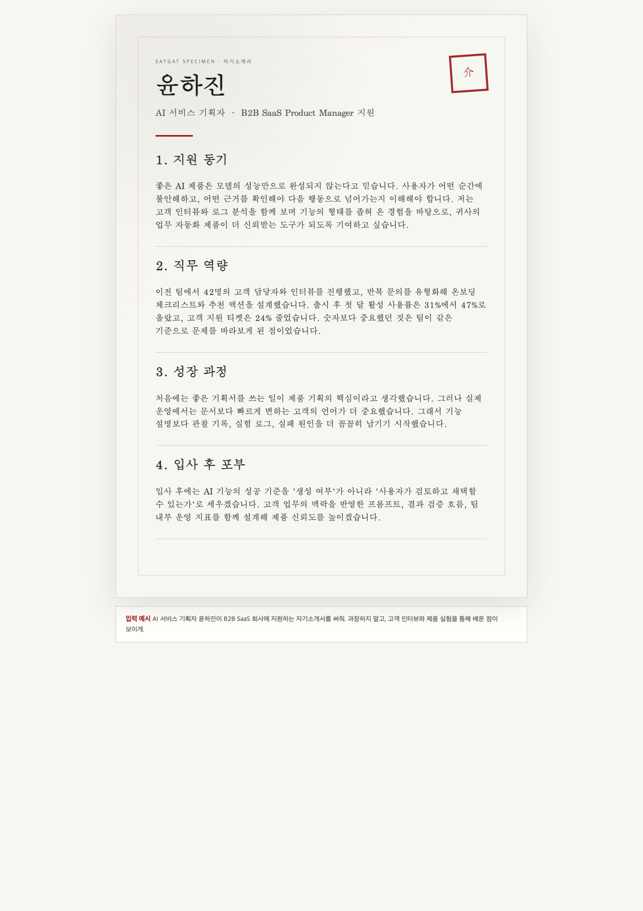
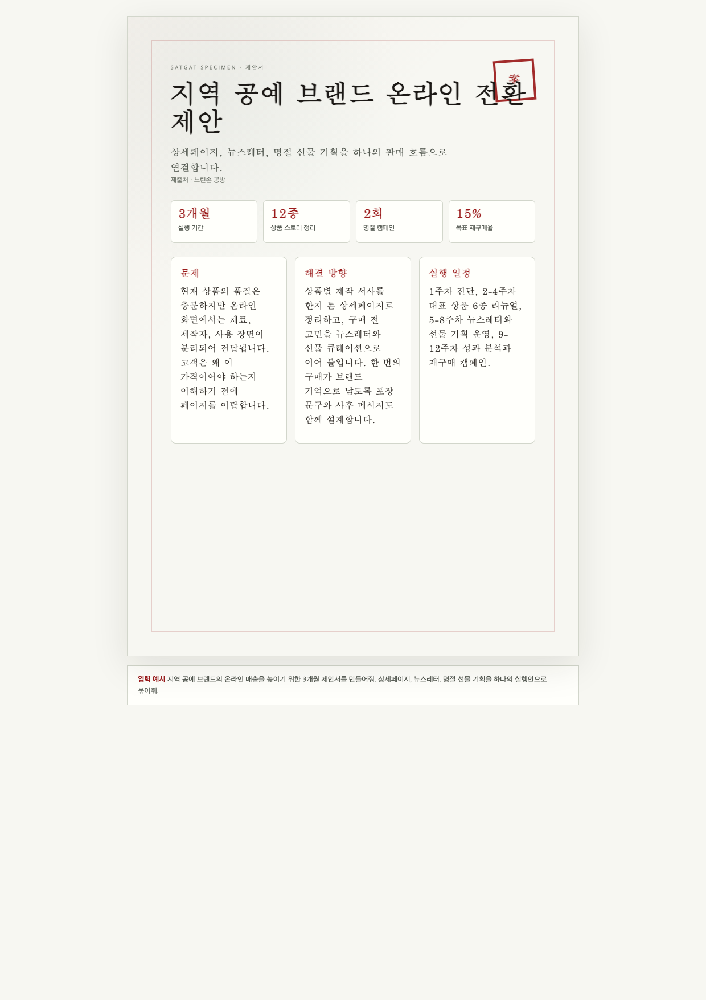
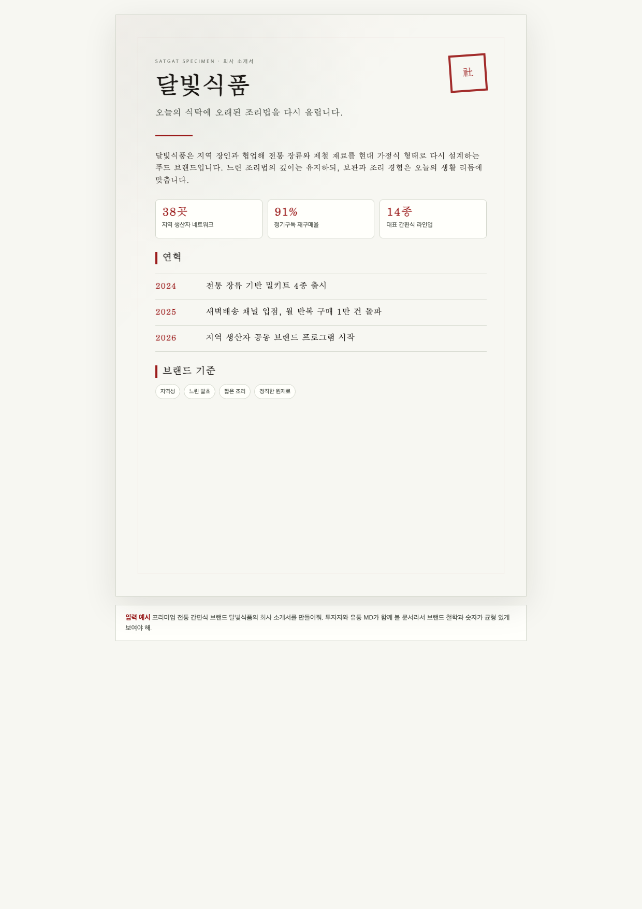
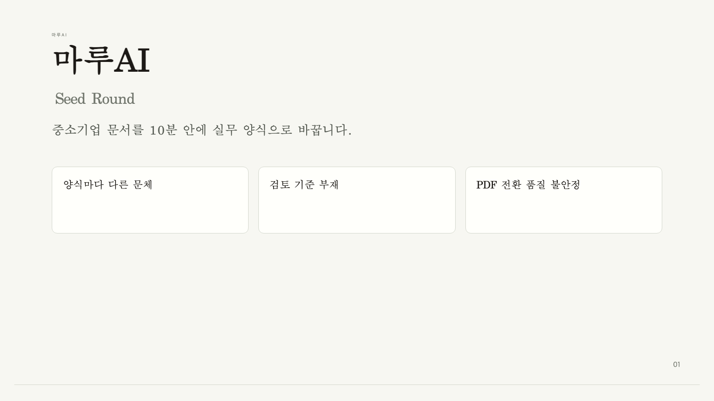
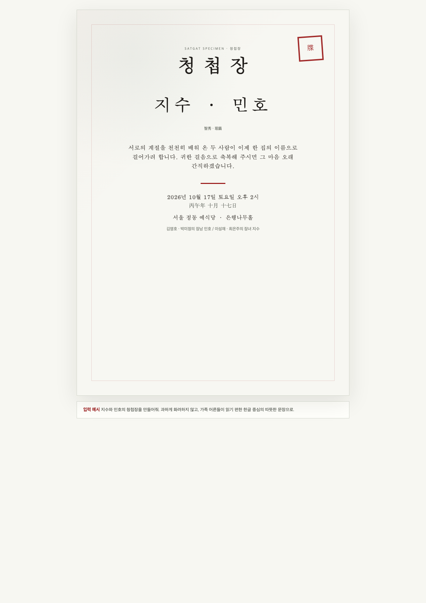

# satgat

> 자연어를 한지(韓紙) 감성의 한국형 문서로 옮겨 적는 AI 문서 생성기.

[](LICENSE)
[](https://nextjs.org)
[](https://react.dev)

`satgat`은 한국 이름으로 **삿갓**입니다. 사용자가 하고 싶은 이야기를 자연어로 적으면, AI가 문서 구조를 잡고 한지 위에 먹글씨를 얹은 듯한 시각 언어로 완성 문서를 렌더링합니다.

워드 기본 양식, 흰 배경 SaaS 문서, 해외 템플릿 번역체 대신 한국어 문서가 자연스럽게 읽히는 종이, 여백, 글꼴, 인장, 색을 기준으로 설계했습니다.


## 한국어 데모팩

satgat 전용 데모팩은 자연어 입력 예시, HTML 원본, PDF, PNG 미리보기를 한 묶음으로 제공합니다. 전체 갤러리는 [한국어 데모팩](public/satgat/assets/examples/ko/index.html)에서 볼 수 있습니다.

| 이력서 | 자기소개서 | 제안서 |
| --- | --- | --- |
|  |  |  |
| 한국어 · A4 · 이력서<br>[HTML](public/satgat/assets/examples/ko/resume-kim-sumin.html) · [PDF](public/satgat/assets/examples/ko/resume-kim-sumin.pdf) | 한국어 · A4 · 4문항<br>[HTML](public/satgat/assets/examples/ko/self-intro-yoon-hajin.html) · [PDF](public/satgat/assets/examples/ko/self-intro-yoon-hajin.pdf) | 한국어 · A4 · 제안서<br>[HTML](public/satgat/assets/examples/ko/proposal-hanji-retail.html) · [PDF](public/satgat/assets/examples/ko/proposal-hanji-retail.pdf) |

| 회사 소개서 | 투자 IR 덱 | 청첩장 |
| --- | --- | --- |
|  |  |  |
| 한국어 · A4 · 회사 소개서<br>[HTML](public/satgat/assets/examples/ko/company-profile-dalbit.html) · [PDF](public/satgat/assets/examples/ko/company-profile-dalbit.pdf) | 한국어 · 16:9 · 5 slides<br>[HTML](public/satgat/assets/examples/ko/investor-deck-maruai.html) · [PDF](public/satgat/assets/examples/ko/investor-deck-maruai.pdf) | 한국어 · A5 감성 · 청첩장<br>[HTML](public/satgat/assets/examples/ko/invitation-jisoo-minho.html) · [PDF](public/satgat/assets/examples/ko/invitation-jisoo-minho.pdf) |

## 예시 프롬프트

```text
7년차 프론트엔드 개발자 김수민의 이력서를 한국 스타트업 채용 담당자가 빠르게 읽을 수 있게 만들어줘.

AI 서비스 기획자 윤하진이 B2B SaaS 회사에 지원하는 자기소개서를 써줘. 과장하지 말고 고객 인터뷰와 제품 실험을 통해 배운 점이 보이게.

지역 공예 브랜드의 온라인 매출을 높이기 위한 3개월 제안서를 만들어줘. 상세페이지, 뉴스레터, 명절 선물 기획을 하나의 실행안으로 묶어줘.

한국 중소기업을 위한 문서 자동화 SaaS의 Seed 투자 IR 덱을 만들어줘. 문제, 해결책, 시장, traction, 요청 금액이 한눈에 보이게.
```

## 동작 흐름

1. 자연어 brief로 목적, 독자, 핵심 내용, 분위기를 적습니다.
2. AI가 문서 유형을 고르고 구조화 JSON으로 슬롯을 채웁니다.
3. satgat 템플릿이 백자지 톤 캔버스, 먹색 타이포그래피, 인장, 여백 규칙으로 렌더링합니다.
4. 결과를 HTML로 검토하고 PNG 미리보기와 PDF 산출물로 저장합니다.

## 만들 수 있는 문서

- 이력서
- 자기소개서
- 명함
- 청첩장
- 연하장
- 회사 제안서
- 뉴스레터
- 포트폴리오
- 회사 소개서
- 제품 소개서
- 브랜드 원페이지
- 브랜드 스토리북
- 투자 IR 덱

종이를 고르고 담을 이야기를 적으면, AI가 템플릿 슬롯을 채운 뒤 브라우저에서 미리보기와 인쇄/PDF 저장이 가능한 문서로 보여 줍니다.

## 디자인 원칙

- 순백 배경이나 누런 양피지 대신 맑은 백자지/닥종이 톤 캔버스 사용
- 먹색 본문과 따뜻한 황갈 계열 회색 사용
- 무궁화, 단청, 취색, 금박을 절제된 강조색으로 사용
- Nanum Myeongjo, Gowun Batang, Gowun Dodum 중심의 한국어 글꼴 위계
- A4, A5, 명함, 16:9 덱까지 인쇄를 고려한 레이아웃
- 합성 볼드와 유료 폰트 의존을 피하고 OFL 무료 폰트 중심으로 구성

## 기술 스택

- Next.js 16 App Router
- React 19
- TypeScript
- AI SDK + `@ai-sdk/google`
- Zod 런타임 검증
- CSS 디자인 토큰 + Tailwind 4 도구 체인

## 시작하기

```bash
git clone https://github.com/unclejobs-ai/satgat.git
cd satgat
npm install
```

`.env.local`을 만들고 Gemini API 키를 넣습니다.

```bash
GOOGLE_GENERATIVE_AI_API_KEY=your_key_here
```

개발 서버를 실행합니다.

```bash
npm run dev
```

브라우저에서 `http://localhost:3000`을 엽니다.

## 스크립트

```bash
npm run dev      # 로컬 개발 서버
npm run demo:ko  # 한국어 데모팩 HTML/manifest 생성
npm run build    # 프로덕션 빌드
npm run start    # 프로덕션 서버 실행
npm run lint     # ESLint 검사
```

## 프로젝트 구조

```text
app/                    Next.js 라우트와 API 핸들러
public/satgat/          정적 specimen 페이지와 디자인 시스템 자산
public/satgat/assets/examples/ko/
                        한국어 데모팩 HTML/PDF/PNG/manifest
src/components/         문서/템플릿 React 컴포넌트
src/lib/design-system/  한지, 먹색, 단청, 취색, 금박 토큰
src/lib/templates/      문서 템플릿 정의와 registry
src/lib/engine/         렌더러와 검증 계층
src/lib/generation/     AI 문서 생성 로직
references/             한국어 문서 작성과 디자인 브리프
docs/                   아키텍처 문서
```

## 공개 저장소

이 프로젝트의 단독 public origin은 아래 주소를 기준으로 합니다.

```text
https://github.com/unclejobs-ai/satgat
```

AI/에이전트가 프로젝트를 빠르게 읽을 수 있도록 [llms.txt](llms.txt)에 목적, 핵심 경로, 데모팩, 명령어를 요약해 두었습니다.

## 라이선스

MIT © 2026 EungjePark
