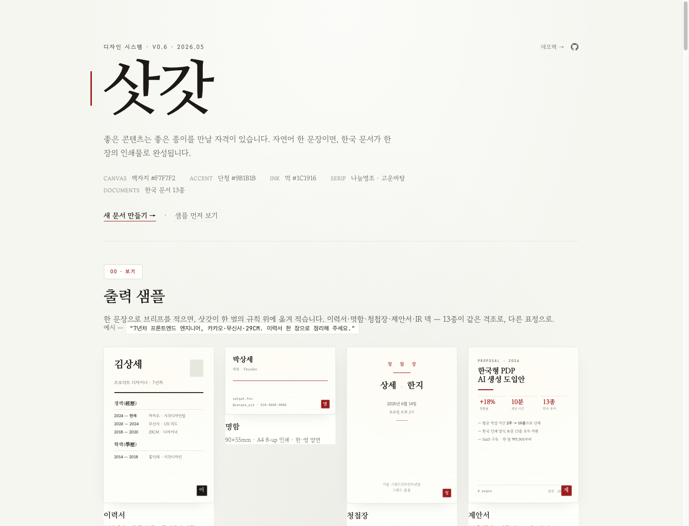
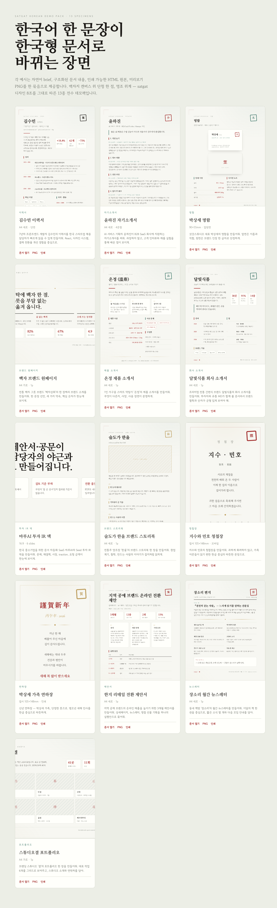

<div align="center">

# 삿갓 · satgat

**한지 위에 먹글씨. AI가 옮겨 적는 한국형 문서 디자인 시스템.**

양피지의 누런 따뜻함이 아니라, 백자지의 맑은 단정함.
자연어 한 문장이면, 한국 문서 한 장이 인쇄물로 완성됩니다.

[웹앱](https://satgat.vercel.app) · [데모팩](public/satgat/assets/examples/ko/) · [skill 설치](#설치) · [라이브 미리보기](https://satgat.vercel.app)

[](LICENSE)
[](https://www.npmjs.com/package/satgat)
[](https://nextjs.org)



</div>

---

## 설치

### Claude Code · Codex · Gemini CLI 등 AI 에이전트용 skill

```bash
npx satgat skill ~/.claude/skills/satgat
```

`SKILL.md`와 한국어 디자인 brief가 그대로 풀립니다. 이후 자연어로 호출하면 끝.

### 새 워크스페이스 (Next.js 풀스택)

```bash
npx satgat init my-satgat
cd my-satgat
npm install
echo "GOOGLE_GENERATIVE_AI_API_KEY=<키>" > .env.local
npm run dev
```

`http://localhost:3000` 열림. 14종 한국 문서 즉시 생성 가능.

### 원본 저장소에서

```bash
git clone https://github.com/unclejobs-ai/satgat.git
cd satgat
npm install
npm run dev
```

---

## 호출 예시

자연어 한 문장. AI 에이전트(Claude/GPT/Gemini)에 그대로 던집니다.

```text
이력서 한 장 만들어 주세요. 7년차 프론트엔드, 카카오·무신사·29CM.

신년 연하장 — 박상세 가족, 단정한 톤으로.

스타트업 IR 덱 한 벌, 시드 단계, 단청 강조.

회사 소개서 — 북촌랩스, 로컬 문화 공간 SaaS. 비전·미션·핵심 가치·연혁·팀.

청첩장 — 민호와 지수, 2026년 10월 17일, 정동 예식당.
```

14종 문서: 이력서 · 자기소개서 · 명함 · 브랜드 원페이지 · 제품 소개서 · 회사 소개서 · 투자 IR 덱 · 브랜드 스토리북 · 청첩장 · 연하장 · 제안서 · 뉴스레터 · 포트폴리오 · 보고서.

---

## 디자인 한 줄

| 항목 | 값 |
|---|---|
| Canvas | 백자지 `#F7F7F2` |
| Accent | 단청 `#9B1B1B` (≤ 5%/page) |
| Ink | 먹 `#1C1916` |
| Serif | 나눔명조 · 고운바탕 |
| Sans | 고운돋움 · Pretendard |

규칙 8개: `references/design.ko.md` 또는 `skills/satgat/SKILL.md` 참조.

---

## 한글 무료 폰트 (OFL)

satgat이 쓰는 한글 폰트. 웹앱은 Google Fonts로 로드하고, **서버 PDF 내려받기**는 `public/fonts/`에 셀프호스팅한 OFL woff2(한자는 Noto Serif KR)를 임베드해 폰트 누락·두부(tofu) 없이 인쇄급으로 떨어집니다. 모두 무료, 상업 사용 가능.

| 폰트 | 역할 | 출처 |
|---|---|---|
| **나눔명조** | 표지 · H1 · 인장 | Google Fonts |
| **고운바탕** | 본문 · 인용 | Google Fonts |
| **고운돋움** | 라벨 · 메타 | Google Fonts |
| **Pretendard** | UI · sans 본문 | orioncactus/pretendard |
| **Noto Serif KR** | 명조 fallback | Google Fonts |
| **Noto Sans KR** | 다국어 페어링 | Google Fonts |
| **Hahmlet** | 두꺼운 명조 디스플레이 | Google Fonts |
| **IBM Plex Sans KR** | 기술 문서 sans | Google Fonts |
| **Black Han Sans** | 강한 헤드라인 (선택) | Google Fonts |

Latin 페어링: Cormorant Garamond italic, JetBrains Mono.

---

## 데모팩 — 13종 specimen

자연어 한 문장이 한국형 문서가 되는 13개 장면. 모두 같은 디자인 8조에서 나왔습니다. 각 예시는 인쇄용 HTML 원본과 미리보기 PNG로 제공됩니다.

<a href="public/satgat/assets/examples/ko/index.html"></a>

| 문서 | 폼팩터 | 미리보기 |
|---|---|---|
| **이력서** · 김수민 | A4 세로 | [열기](public/satgat/assets/examples/ko/resume-kim-sumin.html) · [PNG](public/satgat/assets/examples/ko/resume-kim-sumin.png) |
| **자기소개서** · 윤하진 | A4 세로 · 4문항 | [열기](public/satgat/assets/examples/ko/self-intro-yoon-hajin.html) · [PNG](public/satgat/assets/examples/ko/self-intro-yoon-hajin.png) |
| **명함** · 박상세 | 90×55mm 앞뒷면 | [열기](public/satgat/assets/examples/ko/business-card-parksangse.html) · [PNG](public/satgat/assets/examples/ko/business-card-parksangse.png) |
| **브랜드 원페이지** · 백자상회 | A4 가로 | [열기](public/satgat/assets/examples/ko/one-pager-baekja.html) · [PNG](public/satgat/assets/examples/ko/one-pager-baekja.png) |
| **제품 소개서** · 온정 | A4 세로 | [열기](public/satgat/assets/examples/ko/product-sheet-onjeong.html) · [PNG](public/satgat/assets/examples/ko/product-sheet-onjeong.png) |
| **회사 소개서** · 달빛식품 | A4 세로 | [열기](public/satgat/assets/examples/ko/company-profile-dalbit.html) · [PNG](public/satgat/assets/examples/ko/company-profile-dalbit.png) |
| **투자 IR 덱** · 마루AI | 16:9 · 6장 | [열기](public/satgat/assets/examples/ko/investor-deck-maruai.html) · [PNG](public/satgat/assets/examples/ko/investor-deck-maruai.png) |
| **브랜드 스토리북** · 술도가 한울 | A4 세로 | [열기](public/satgat/assets/examples/ko/brand-storybook-sool.html) · [PNG](public/satgat/assets/examples/ko/brand-storybook-sool.png) |
| **청첩장** · 지수와 민호 | 엽서 105×148mm | [열기](public/satgat/assets/examples/ko/invitation-jisoo-minho.html) · [PNG](public/satgat/assets/examples/ko/invitation-jisoo-minho.png) |
| **연하장** · 박상세 가족 | 엽서 105×148mm | [열기](public/satgat/assets/examples/ko/newyear-card-park.html) · [PNG](public/satgat/assets/examples/ko/newyear-card-park.png) |
| **제안서** · 한지 리테일 | A4 세로 | [열기](public/satgat/assets/examples/ko/proposal-hanji-retail.html) · [PNG](public/satgat/assets/examples/ko/proposal-hanji-retail.png) |
| **뉴스레터** · 장소리 | A4 세로 | [열기](public/satgat/assets/examples/ko/newsletter-jangsori.html) · [PNG](public/satgat/assets/examples/ko/newsletter-jangsori.png) |
| **포트폴리오** · 스튜디오결 | A4 가로 | [열기](public/satgat/assets/examples/ko/portfolio-studio-gyeol.html) · [PNG](public/satgat/assets/examples/ko/portfolio-studio-gyeol.png) |

전체 갤러리: [한국어 데모팩](public/satgat/assets/examples/ko/index.html) · 재생성 `npm run demo:ko`.

---

## 스크립트

```bash
npm run dev               # 로컬 개발 서버
npm run build             # 프로덕션 빌드
npm run start             # 프로덕션 서버
npm run lint              # ESLint
npm run verify:templates  # 14종 템플릿·렌더러·UI 일치 검증
npm run demo:ko           # 한국어 데모팩 HTML/manifest 재생성
```

또는 CLI 직접:

```bash
npx satgat help           # 도움말
npx satgat dev            # next dev wrap
npx satgat init <dir>     # 새 워크스페이스
npx satgat skill <dir>    # AI agent용 skill 폴더 내보내기
```

---

## 프로젝트 구조

```text
app/                          Next.js App Router · API · 페이지
bin/satgat.mjs                npx CLI 엔트리
src/components/               14종 문서 React 렌더러
src/lib/design-system/        한지·먹·단청·취색·금박 토큰 (constraint.ts)
src/lib/templates/            슬롯·section·registry
src/lib/engine/               렌더 + 검증 + 슬롯 정규화
src/lib/generation/           AI 프롬프트 → 슬롯 데이터
src/lib/bridge/prompt-builder.ts  type-aware 생성 프롬프트
scripts/verify-template-catalog.mjs   계약 검증
scripts/template-preview-fixtures.mjs 14종 미리보기 fixture
scripts/generate-korean-demo-pack.mjs 데모팩 생성 (scripts/demo/* css·data·layouts)
public/satgat/                정적 specimen + 한국어 데모팩
skills/satgat/SKILL.md        AI agent용 brief
references/                   디자인·글쓰기·이력서·안티패턴 가이드
```

---

## 동작 흐름

1. **brief** — 자연어로 목적·독자·핵심 사실 적기.
2. **slot fill** — AI가 type-aware JSON 스켈레톤을 채움. 모든 list/table/image 슬롯은 구조화 데이터로.
3. **render** — satgat 렌더러가 백자지 캔버스 위에 명조 위계로 옮겨 적음.
4. **export** — `PDF 내려받기` 버튼으로 서버 렌더 PDF(셀프호스팅 OFL 폰트 임베드, 한자 두부 없음). 브라우저 인쇄·PNG 미리보기·HTML 저장도 그대로.

---

## 디자인 8조

1. 백자지 `#F7F7F2`. 양피지 누런 크림 금지.
2. 단청 `#9B1B1B`. 한 페이지의 5% 이내.
3. 모든 회색은 회녹빛. 푸른 회색 금지.
4. 제목은 명조(600-700), 본문은 바탕(400). 위계는 크기로.
5. 한글 본문 행간 1.7–1.8.
6. 태그·배지는 solid hex. rgba 금지.
7. 여백은 디자인. xl/2xl 간격 두려워하지 말 것.
8. 합성 볼드 금지. 폰트 정의 weight만.

전문: `skills/satgat/SKILL.md`, `references/design.ko.md`.

---

## 라이선스

MIT © 2026 [unclejobs-ai](https://github.com/unclejobs-ai).

번들된 폰트는 각 폰트의 OFL · MIT 라이선스를 따릅니다. 상업 사용 가능.
